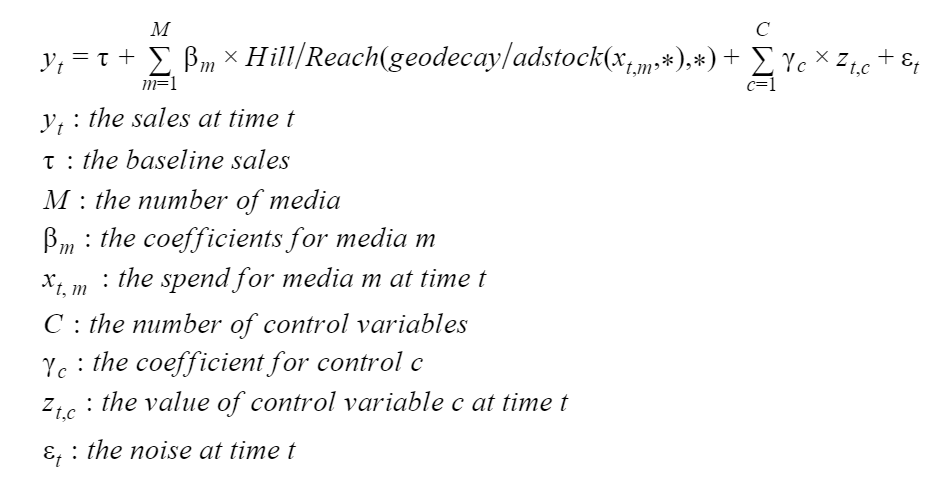

# BayesianMMM

For years scientists have tried to find the best way to model the relationship between media spends and revenue. Once this relationship modelled one can easily find the optimal media mix, a very valuable insight.

Here we merely propose an implementation of one of the latest one: [bayesian methods for media mix modeling with carryover and shape effect](https://static.googleusercontent.com/media/research.google.com/en//pubs/archive/46001.pdf). 

------------------

## Media Transformations

### Carryover
 
More often than not we make the hypothesis that media spends have a lasting impact on sales over several days, weeks or days. Also, sometimes we make the hypothesis that the effects of media spends on sales are delayed. The carryover transformations allows to explicitly integrate those hypotheses into our model. Here we give the user the choice to use either a geo decay or adstock transformation.

#### Geo Decay

The geo decay transformations allows us to model the lasting impact of marketing spends.


#### Adstock

The adstock transformation allow us to model the lasting impact and delayed effect of marketing spends.


### Diminushing Returns (ie Shape Effect)

We also might want to make the hypothesis that the spends impact on sales follows a S curves. We can explictly integrate this hypothesis in our model using either the hill or reach transformation.

#### Hill


#### Reach


--------------

## Model

Putting it all together or model can be expressed by the following formula.




------------

## Sampling Techniques

Media mix modeling datasets are often small with less than 500 observations. This raises some issues when fitting a media mix model. To address those concerns the model's parameters are estimated using MCMC as implemented in Stan.

------------

## Results

This implementation output multiple results during the training phase. Those are all stored under the results folder.

/console look results folder
Here the list of those

```bash

    .
    ├── ...
    ├── results                                     # results files 
    │   ├── contributions_*.csv                     # contributions of each variables
    │   ├── performance_*.json                      # mape on train and test set
    │   ├── prediction_*.csv                        # prediction on train and test set
    │   ├── plot                                    # plot based results
    │   |    ├── carryover_*.html                   # plot of carryover effect on each media
    │   |    ├── diminushing_returns_*.html         # plot of diminushing returns effect on each media    
    │   |    ├── sample_*.html                      # plot of parameters' posterior
    │   |    ├── contributions_analysis_*.html      # dashboard of media contributions   
    |   │    └── true_vs_pred_*.html                # .plot of pred and true values     
    │   ├── inference_machine                       # .pkl files to load fitted inference machine
    │   └── normalizer                              # .pkl, json files to load fitted normalizer
    └── ...


```

-------------


## Usage

In order to use this implementation two options are avalaible from the console using the train_bayesian_mmm command or by running train.py (bayesian_mmm/train.py)

Before doing so the user must update the config file (config/train.yaml) appropriatly.

-------------

## Config 

```yaml
DATA_SOURCE_PATH: "./data/mmm.csv"      #location of mmm dataset sep=","

EXPERIMENT_NM: "demo"                   #name that will be used for results

MEDIA_NMS:                              #must be in same order as in mmm dataset
  - TV
  - radio
  - newspaper
CTRL_NMS: []                            #the ctrl variables to use (if any)
DATE_NM: "week_dt" 
TARGET_NM: "sales"  

NORMALIZATION:                          #how to normalize the variables
  PREDICTORS:
    transfo_nm: "log"                   #avalaible options: "log", None, "sqrt"
    scaler_nm: "max_abs"                #avalaible options: "max_abs", "min_max"
  TARGET:
    transfo_nm: "log"
    scaler_nm: "max_abs"

MAX_LAG: 13
CARRYOVER_TRANSFO_NM: "geo_decay"       #avalaible options: "geo_decay", "adstock"
DIMINUSHING_RETURNS_TRANSFO_NM: "reach" #avalaible options: "hill", "reach"

SAMPLING_N_ITER: 1000                   #nb of sampling iterations to run
SAMPLING_N_PROCESSORS: 3                #nb of processors to use for sampling

PARAMETER_ESTIMATOR_NM: "median"        #estimator to use on posterior of parameters

NB_TEST_OBS: 20                         #nb of observations to use for testing

```
--------------


## Installation

```bash

$ conda env create -f environment.yaml
$ conda activate bayesian_mmm
$ pip install -e .

```


## Further Developments

Give the user the ability to:

- cap gamma ctrl values
- cap tau value
- cap beta medias values
- change the spend transfo order (as proposed in the paper)
- choose media transformations at media level
- set custom priors
- use a multiplicative model

----------------


## References

- [Bayesian methods for media mix modeling with carryover and shape effect](https://research.google/pubs/pub46001/)
- [Challenges and Opportunities in Media Mix Modeling](https://static.googleusercontent.com/media/research.google.com/en//pubs/archive/45998.pdf)

-----------------

## Notes

On Windows, conda distribution must be used. pystan cannot be installed on Windows with python.


